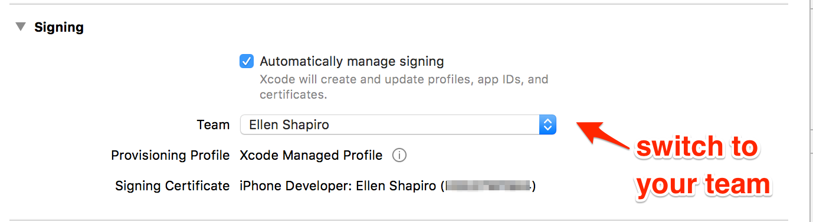
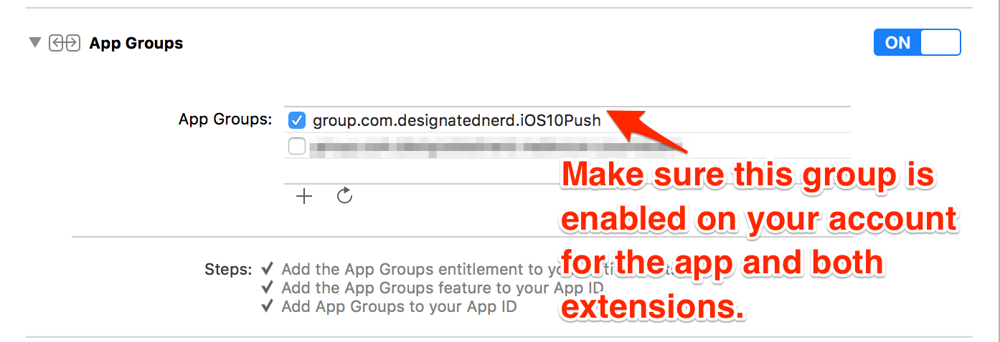

# iOS10NotificationSample
Sample code for my talk about iOS 10 notifications 

**NOTE**: Updates to allow the app to use a shared container are going to whine at you about provisioning and signing stuff unless on the main `NotificationSample` target, you update the development team to your own, and add the appropriate app group to your account's list of app groups. 

As of Xcode 8.3.2, this looks like: 

